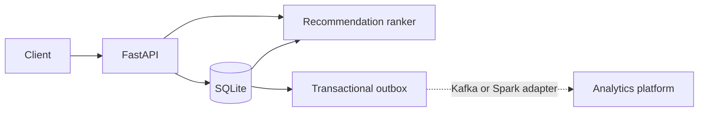

# Video Platform Systems

A runnable YouTube-style backend focused on event ingestion, watch analytics and
explainable recommendation ranking. The project models the engineering boundaries behind
a video product instead of reproducing YouTube's visual interface.

## What works

- idempotent watch-event ingestion with a transactional outbox
- SQLite persistence with foreign keys, WAL mode and analytics indexes
- per-video watch time, unique-viewer and completion metrics
- deterministic ranking from popularity, category affinity and freshness
- exclusion of previously watched videos and human-readable ranking reasons
- FastAPI catalog, ingestion, analytics and recommendation endpoints
- deterministic sample data, CLI demo, Docker image and multi-version CI

## Run it

```bash
python -m venv .venv
. .venv/bin/activate
pip install -e '.[dev]'
pytest
video-platform --database demo.db --user alice
uvicorn video_platform.api:app --reload
```

Open `http://127.0.0.1:8000/docs` for the API contract.

## API

| Method | Path | Purpose |
|---|---|---|
| `GET` | `/health` | service health |
| `GET` | `/videos` | active catalog |
| `POST` | `/events/watch` | idempotent watch ingestion |
| `GET` | `/analytics/videos/{video_id}` | watch and completion metrics |
| `GET` | `/recommendations/{user_id}` | ranked unseen candidates |

Replaying an existing `event_id` returns a duplicate acknowledgement without double-counting
analytics or creating another outbox event.

## Ranking model

The baseline ranks unseen active videos with a transparent weighted score:

```text
0.45 × engaged popularity + 0.35 × category affinity + 0.20 × freshness
```

It is a production-minded baseline that can later be replaced by learned retrieval/ranking
models without changing the event or API contracts.

## Architecture



SQLite keeps the demo self-contained. The repository and outbox boundaries make migration to
PostgreSQL and Kafka explicit rather than pretending local code is already distributed.
